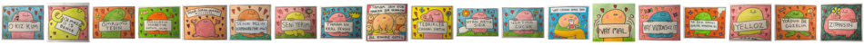

# Çıkartmalar - WhatsApp için

Küçük resimleri Linux'ta yaratmak için komut:

```bash
convert +append {1..30}.webp[0] -resize x50 thumbnails.png
```

## [arkadaşlar - 1](./0__whatsapp-sticker-packs/arkadaslar1.wastickers)


## [arkadaşlar - 2](./0__whatsapp-sticker-packs/arkadaslar2.wastickers)


## [cuma](./0__whatsapp-sticker-packs/cuma.wastickers)


## [dert](./0__whatsapp-sticker-packs/dert.wastickers)


## [dizi - 1](./0__whatsapp-sticker-packs/dizi1.wastickers)


## [dizi - 2](./0__whatsapp-sticker-packs/dizi2.wastickers)


## [dizi - gibi - diğer](./0__whatsapp-sticker-packs/dizi-gibi-diger.wastickers)


## [dizi - gibi - övgü - 1](./0__whatsapp-sticker-packs/dizi-gibi-ovgu1.wastickers)


## [dizi - gibi - övgü - 2](./0__whatsapp-sticker-packs/dizi-gibi-ovgu2.wastickers)


## [eski oyun](./0__whatsapp-sticker-packs/eski-oyun.wastickers)


## [hayvanlar](./0__whatsapp-sticker-packs/hayvanlar.wastickers)


## [hayvanlar - kedi](./0__whatsapp-sticker-packs/hayvanlar-kedi.wastickers)


## [ibo](./0__whatsapp-sticker-packs/ibo.wastickers)


## [içmek](./0__whatsapp-sticker-packs/icmek.wastickers)


## [karikatür](./0__whatsapp-sticker-packs/karikatur.wastickers)


## [karikatür - mert dolapçıoğlu - 1](./0__whatsapp-sticker-packs/karikatur-mert1.wastickers)


## [karikatür - mert dolapçıoğlu - 2](./0__whatsapp-sticker-packs/karikatur-mert2.wastickers)


## [kutlama](./0__whatsapp-sticker-packs/kutlama.wastickers)


## [meme - köksal baba](./0__whatsapp-sticker-packs/meme-koksal-baba.wastickers)


## [meme - türk - 1](./0__whatsapp-sticker-packs/meme-turk1.wastickers)


## [meme - türk - 2](./0__whatsapp-sticker-packs/meme-turk2.wastickers)


## [meme - türk - 3](./0__whatsapp-sticker-packs/meme-turk3.wastickers)


## [meme - türk - 4](./0__whatsapp-sticker-packs/meme-turk4.wastickers)


## [meme - yabancı](./0__whatsapp-sticker-packs/meme-yabanci.wastickers)


## [meme - yüzler](./0__whatsapp-sticker-packs/meme-yuzler.wastickers)


## [müzik](./0__whatsapp-sticker-packs/muzik.wastickers)


## [olmazsa olmaz](./0__whatsapp-sticker-packs/olmazsa-olmaz.wastickers)


## [sevgi](./0__whatsapp-sticker-packs/sevgi.wastickers)


## [sinir](./0__whatsapp-sticker-packs/sinir.wastickers)


## [siyaset - 1](./0__whatsapp-sticker-packs/siyaset1.wastickers)


## [siyaset - 2](./0__whatsapp-sticker-packs/siyaset1.wastickers)


## [yesilçam - 1](./0__whatsapp-sticker-packs/yesilcam1.wastickers)


## [yesilçam - 2](./0__whatsapp-sticker-packs/yesilcam2.wastickers)


## [yesilçam - yeni](./0__whatsapp-sticker-packs/yesilcam-yeni.wastickers)


## [yetişkin - 1](./0__whatsapp-sticker-packs/yetiskin1.wastickers)


## [yetişkin - 2](./0__whatsapp-sticker-packs/yetiskin2.wastickers)


## [yüzler](./0__whatsapp-sticker-packs/yuzler.wastickers)


## [zalım](./0__whatsapp-sticker-packs/zalim.wastickers)

